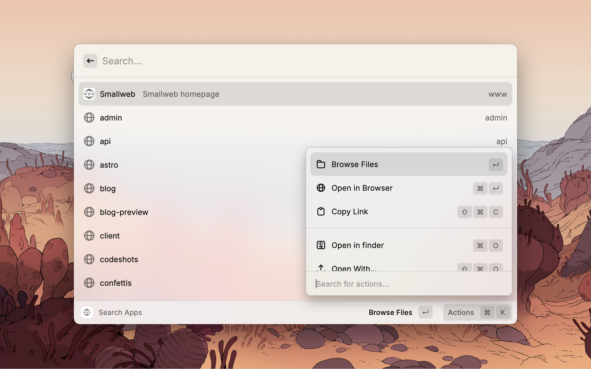
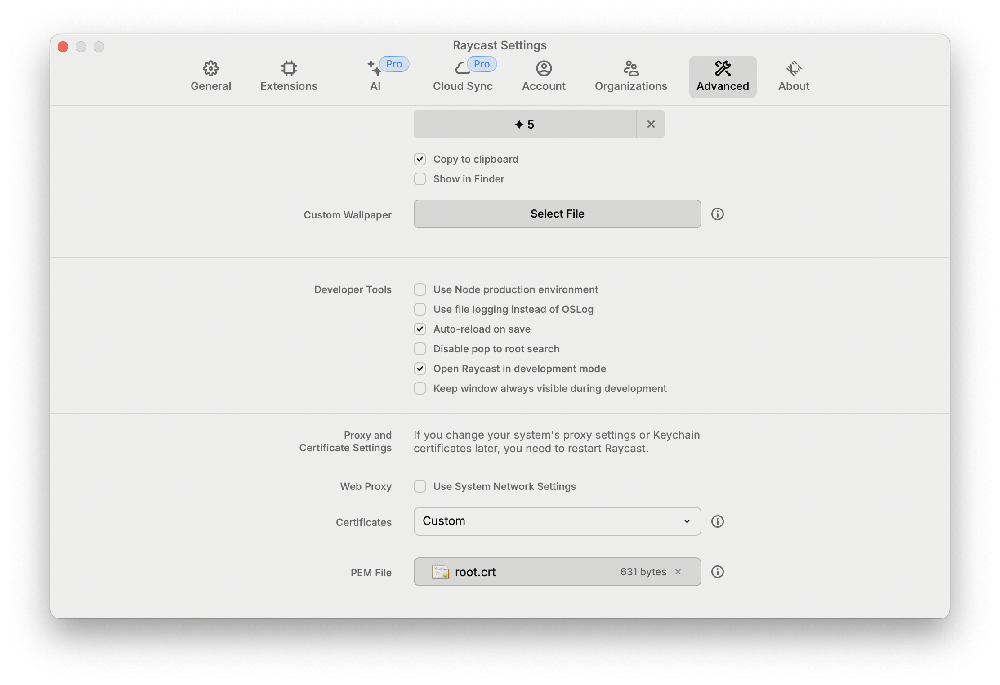

# Smallweb Raycast Extension



## Install

1. `npm install`
2. `npm run dev` (while raycast is running)

## Installing self-signed certificates

If you're using `*.localhost` domains, you'll need to tell raycast to use caddy self-signed certificates.

You can configure them in the raycast Advanced settings.



If you installed caddy using homebrew, you can find the root certificate at `/opt/homebrew/var/lib/caddy/pki/authorities/local/root.crt`.

## Configuration

1. Make sure that you have created the an app for the api

    ```jsonc
    // ~/smallweb/api/smallweb.json
    {
        "entrypoint": "smallweb:api",
        "private": true,
        "publicRoutes": [
            "/openapi.json",
            "/schemas/*"
        ]
    }
    ```

2. Generate a token for the app

    ```bash
    smallweb token create --app api --description "raycast extension"
    ```

3. Pass both the url and the token to the extension at start

4. (Optional) If smallweb is synced to a folder on your desktop, you can configure it in the extension parameters
